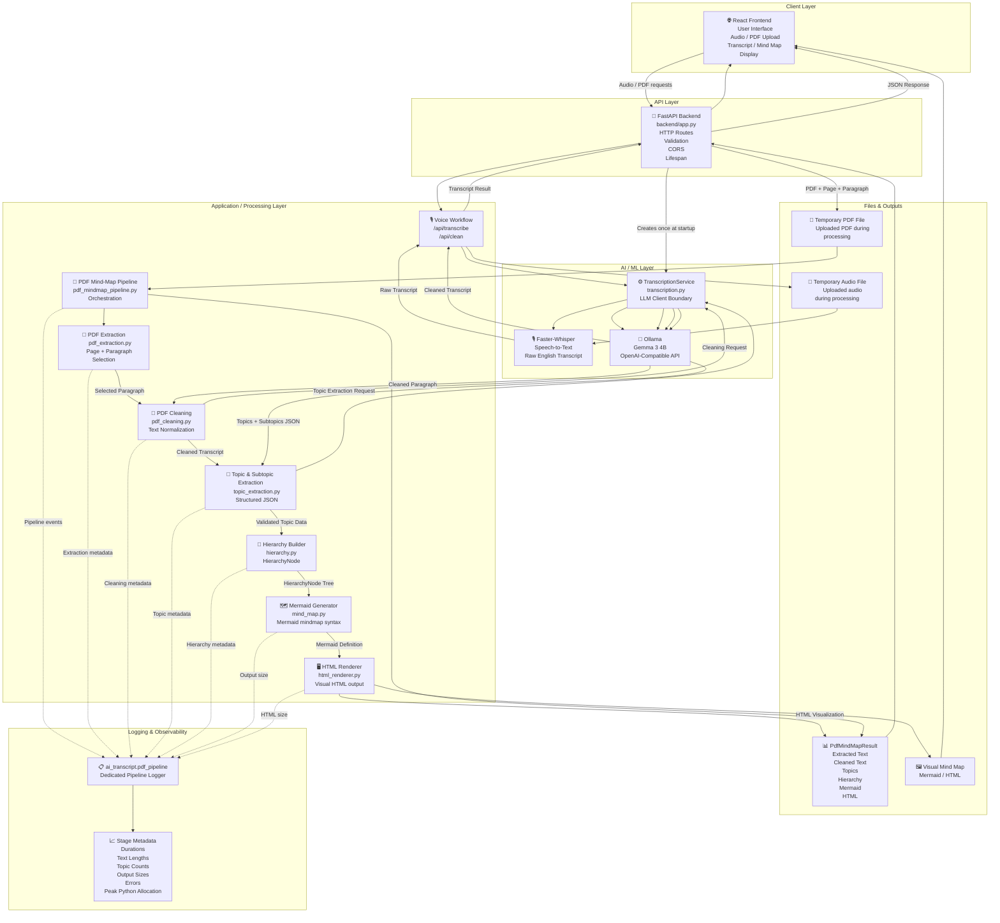

## System Architecture

```mermaid
graph TD

    %% =========================
    %% Client Layer
    %% =========================
    subgraph Client["Client Layer"]
        Browser["🌐 React Frontend
        User Interface
        Audio / PDF Upload
        Transcript / Mind Map Display"]
    end

    %% =========================
    %% API Layer
    %% =========================
    subgraph API["API Layer"]
        FastAPI["🚀 FastAPI Backend
        backend/app.py
        HTTP Routes
        Validation
        CORS
        Lifespan"]
    end

    %% =========================
    %% Application Layer
    %% =========================
    subgraph Application["Application / Processing Layer"]

        Voice["🎙️ Voice Workflow
        /api/transcribe
        /api/clean"]

        Pipeline["🔄 PDF Mind-Map Pipeline
        pdf_mindmap_pipeline.py
        Orchestration"]

        Extraction["📄 PDF Extraction
        pdf_extraction.py
        Page + Paragraph Selection"]

        Cleaning["🧹 PDF Cleaning
        pdf_cleaning.py
        Text Normalization"]

        Topics["🧠 Topic & Subtopic Extraction
        topic_extraction.py
        Structured JSON"]

        Hierarchy["🌳 Hierarchy Builder
        hierarchy.py
        HierarchyNode"]

        Mermaid["🗺️ Mermaid Generator
        mind_map.py
        Mermaid mindmap syntax"]

        HTML["🖥️ HTML Renderer
        html_renderer.py
        Visual HTML output"]
    end

    %% =========================
    %% AI / ML Layer
    %% =========================
    subgraph AI["AI / ML Layer"]

        Whisper["🎙️ Faster-Whisper
        Speech-to-Text
        Raw English Transcript"]

        Ollama["🤖 Ollama
        Gemma 3 4B
        OpenAI-Compatible API"]

        Service["⚙️ TranscriptionService
        transcription.py
        LLM Client Boundary"]
    end

    %% =========================
    %% Temporary / Output Resources
    %% =========================
    subgraph Resources["Files & Outputs"]

        AudioTemp["📁 Temporary Audio File
        Uploaded audio during processing"]

        PDFTemp["📁 Temporary PDF File
        Uploaded PDF during processing"]

        Result["📊 PdfMindMapResult
        Extracted Text
        Cleaned Text
        Topics
        Hierarchy
        Mermaid
        HTML"]

        Visual["🖼️ Visual Mind Map
        Mermaid / HTML"]
    end

    %% =========================
    %% Observability
    %% =========================
    subgraph Observability["Logging & Observability"]

        Logger["📋 ai_transcript.pdf_pipeline
        Dedicated Pipeline Logger"]

        Metrics["📈 Stage Metadata
        Durations
        Text Lengths
        Topic Counts
        Output Sizes
        Errors
        Peak Python Allocation"]
    end

    %% =========================
    %% Client → API
    %% =========================

    Browser -->|Audio / PDF requests| FastAPI

    %% =========================
    %% Voice Workflow
    %% =========================

    FastAPI --> Voice
    Voice --> AudioTemp
    AudioTemp --> Whisper
    Whisper -->|Raw Transcript| Voice
    Voice --> Service
    Service --> Ollama
    Ollama -->|Cleaned Transcript| Voice
    Voice -->|Transcript Result| FastAPI
    FastAPI --> Browser

    %% =========================
    %% PDF Workflow
    %% =========================

    FastAPI -->|PDF + Page + Paragraph| PDFTemp
    PDFTemp --> Pipeline

    Pipeline --> Extraction
    Extraction -->|Selected Paragraph| Cleaning

    Cleaning -->|Cleaning Request| Service
    Service --> Ollama
    Ollama -->|Cleaned Paragraph| Cleaning

    Cleaning -->|Cleaned Transcript| Topics

    Topics -->|Topic Extraction Request| Service
    Service --> Ollama
    Ollama -->|Topics + Subtopics JSON| Topics

    Topics -->|Validated Topic Data| Hierarchy
    Hierarchy -->|HierarchyNode Tree| Mermaid
    Mermaid -->|Mermaid Definition| HTML
    HTML -->|HTML Visualization| Result

    Pipeline --> Result
    Result --> FastAPI
    FastAPI -->|JSON Response| Browser
    HTML --> Visual
    Visual --> Browser

    %% =========================
    %% Logging Connections
    %% =========================

    Pipeline -.->|Pipeline events| Logger
    Extraction -.->|Extraction metadata| Logger
    Cleaning -.->|Cleaning metadata| Logger
    Topics -.->|Topic metadata| Logger
    Hierarchy -.->|Hierarchy metadata| Logger
    Mermaid -.->|Output size| Logger
    HTML -.->|HTML size| Logger

    Logger --> Metrics

    %% =========================
    %% Service Relationships
    %% =========================

    FastAPI -->|Creates once at startup| Service
    Service --> Whisper
    Service --> Ollama
```
