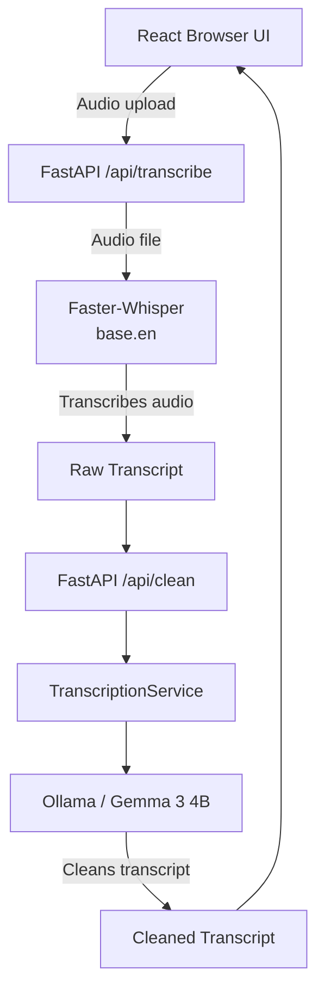
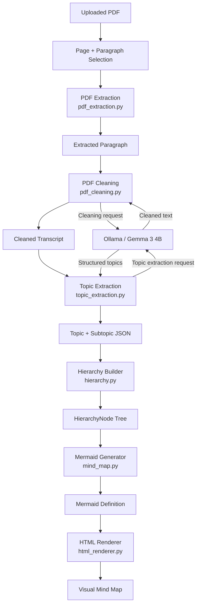
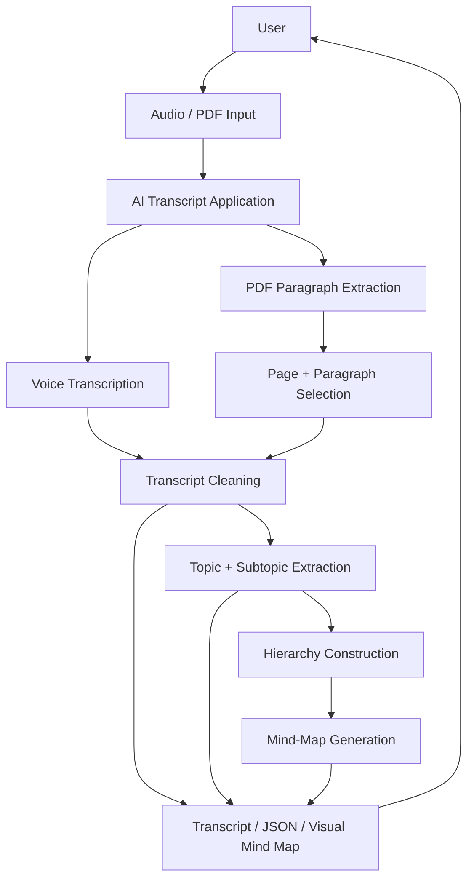
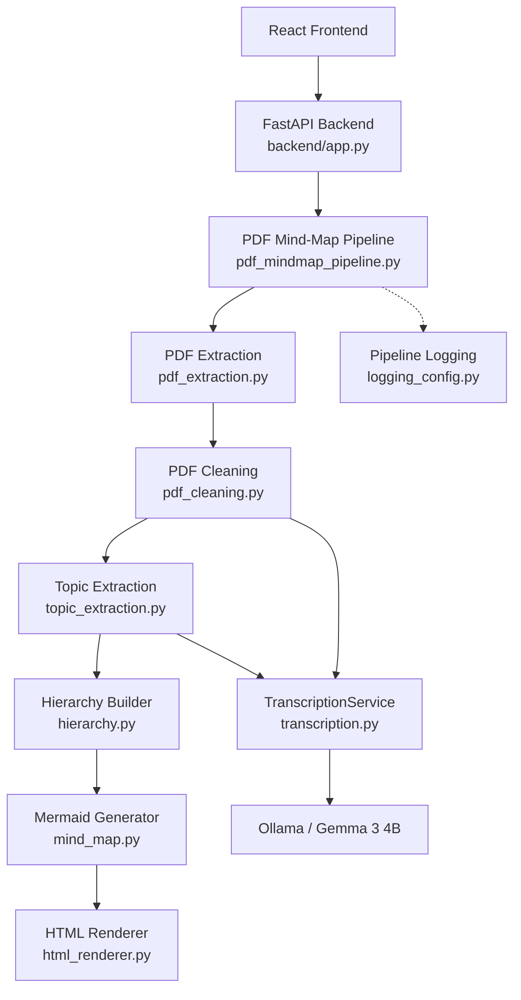
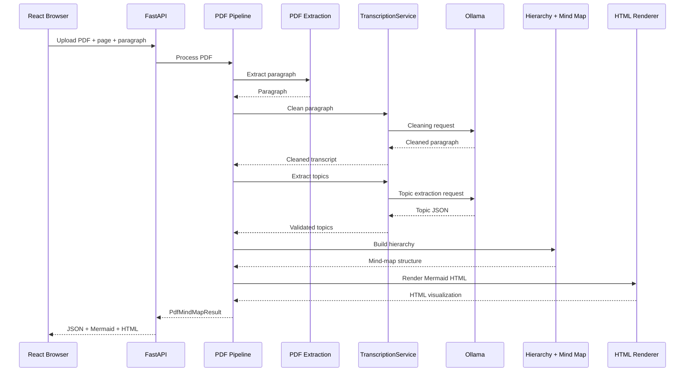
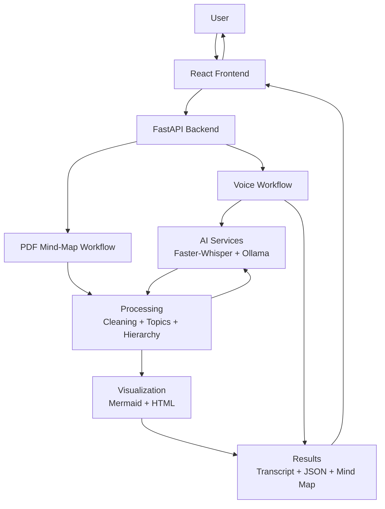

# Diagrams

## 1. Existing Voice Transcription Flow

This diagram shows the original voice-transcription workflow that existed in the project before the PDF mind-map extension.

---

## 2. PDF-to-Mind-Map Data Flow

This diagram shows how a selected PDF paragraph moves through extraction, cleaning, topic extraction, hierarchy construction, Mermaid generation, and HTML rendering.

---

## 3. Data Flow Diagram (DFD)

This DFD shows the main movement of data through the application from user input to the final outputs.

---

## 4. Component Architecture

This diagram shows the main components of the application and how they interact.

---

## 5. POST `/api/pdf-mindmap` Sequence

This sequence diagram shows the runtime interaction when the user uploads a PDF and requests a specific page and paragraph.

---

## 6. High-Level System Data Flow

This diagram summarizes the complete system from user input to the final transcript and mind-map outputs.

---

## Diagram Overview

The six diagrams describe the system at different levels:

1. **Existing Voice Transcription Flow**  
   Shows the original audio transcription workflow.

2. **PDF-to-Mind-Map Data Flow**  
   Shows the detailed processing of a selected PDF paragraph.

3. **Data Flow Diagram (DFD)**  
   Shows the overall movement of data through the application.

4. **Component Architecture**  
   Shows the main software components and their relationships.

5. **POST `/api/pdf-mindmap` Sequence**  
   Shows the runtime interaction between the frontend, backend, pipeline, LLM, and output components.

6. **High-Level System Data Flow**  
   Shows the complete system at a simplified architectural level.
