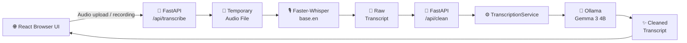
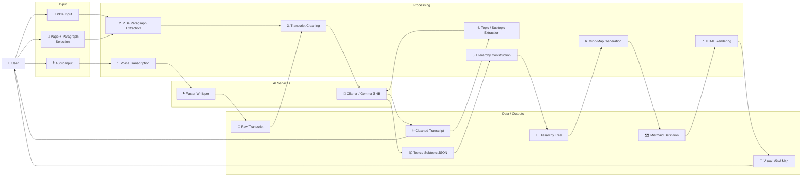
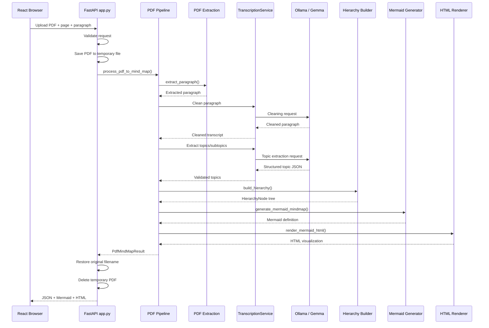
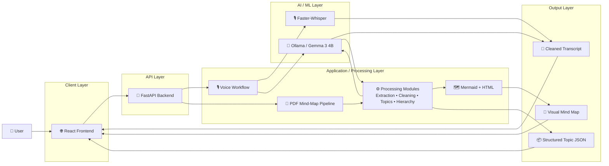

# Diagrams

## 1. Existing Voice Transcription Flow

This diagram shows the original voice-transcription workflow that existed in the project before the PDF mind-map extension.



---

## 2. PDF-to-Mind-Map Data Flow

This diagram shows how a selected PDF paragraph moves through extraction, cleaning, topic extraction, hierarchy construction, Mermaid generation, and HTML rendering.

```mermaid
flowchart LR

    PDF["📑 Uploaded PDF"]

    Selection["📌 Page + Paragraph<br/>Selection"]

    Extract["📄 pdf_extraction.py<br/>Extract selected body paragraph"]

    Paragraph["📝 Extracted<br/>Paragraph"]

    Clean["🧹 pdf_cleaning.py<br/>Clean and normalize text"]

    LLM1["🤖 Ollama / Gemma 3 4B"]

    Transcript["✨ Cleaned<br/>Transcript"]

    Topics["🧠 topic_extraction.py<br/>Extract topics and subtopics"]

    TopicJSON["📦 Validated<br/>Topic JSON"]

    Hierarchy["🌳 hierarchy.py<br/>Build recursive hierarchy"]

    Tree["🌲 HierarchyNode<br/>Tree"]

    Mermaid["🗺️ mind_map.py<br/>Generate Mermaid mindmap"]

    Definition["📋 Mermaid<br/>Definition"]

    HTML["🖥️ html_renderer.py<br/>Generate HTML"]

    Visual["🎨 Visual<br/>Mind Map"]

    PDF --> Selection
    Selection --> Extract
    Extract --> Paragraph
    Paragraph --> Clean

    Clean -->|Cleaning request| LLM1
    LLM1 -->|Cleaned text| Clean

    Clean --> Transcript
    Transcript --> Topics

    Topics -->|Topic extraction request| LLM1
    LLM1 -->|Topics + subtopics JSON| Topics

    Topics --> TopicJSON
    TopicJSON --> Hierarchy
    Hierarchy --> Tree
    Tree --> Mermaid
    Mermaid --> Definition
    Definition --> HTML
    HTML --> Visual
```



---

## 3. Data Flow Diagram (DFD)

This DFD shows how data moves through the extended application from user input to transcript and mind-map outputs.



---

## 4. Component Architecture

This diagram shows the main backend modules and their relationships.

```mermaid
flowchart LR

    subgraph Client["Client Layer"]
        Browser["🌐 React Frontend<br/>User Interface"]
    end

    subgraph API["API Layer"]
        App["🚀 FastAPI<br/>backend/app.py"]
    end

    subgraph Application["Application Layer"]
        Pipeline["🔄 PDF Mind-Map Pipeline<br/>pdf_mindmap_pipeline.py"]

        Extraction["📄 PDF Extraction<br/>pdf_extraction.py"]

        Cleaning["🧹 PDF Cleaning<br/>pdf_cleaning.py"]

        Topics["🧠 Topic Extraction<br/>topic_extraction.py"]

        Hierarchy["🌳 Hierarchy Construction<br/>hierarchy.py"]

        MindMap["🗺️ Mermaid Generation<br/>mind_map.py"]

        Renderer["🖥️ HTML Rendering<br/>html_renderer.py"]
    end

    subgraph ServiceLayer["Service / AI Layer"]
        Service["⚙️ TranscriptionService<br/>transcription.py"]

        Whisper["🎙️ Faster-Whisper<br/>Speech-to-Text"]

        Ollama["🤖 Ollama<br/>Gemma 3 4B"]
    end

    subgraph Observability["Observability"]
        Logs["📋 logging_config.py<br/>ai_transcript.pdf_pipeline"]
    end

    Browser -->|HTTP requests| App

    App -->|PDF request| Pipeline
    App -->|Creates / uses service| Service

    Pipeline --> Extraction
    Pipeline --> Cleaning
    Pipeline --> Topics
    Pipeline --> Hierarchy
    Pipeline --> MindMap
    Pipeline --> Renderer

    Cleaning -->|uses clean_with_llm()| Service
    Topics -->|uses LLM boundary| Service

    Service --> Whisper
    Service --> Ollama

    Pipeline -.->|logging| Logs
    Extraction -.->|logging| Logs
    Cleaning -.->|logging| Logs
    Topics -.->|logging| Logs
```

---

## 5. POST `/api/pdf-mindmap` Sequence

This sequence diagram shows the runtime interaction when the user uploads a PDF and requests a specific page and paragraph.



---

## 6. High-Level System Data Flow

The following diagram summarizes the complete extended system from user input to transcript and mind-map outputs.


