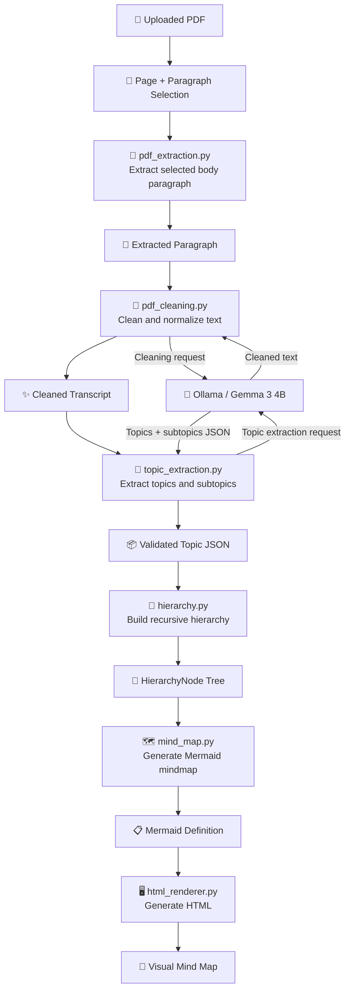
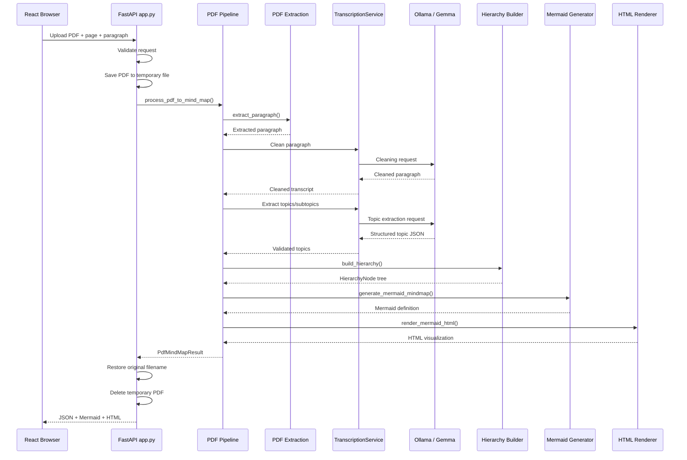
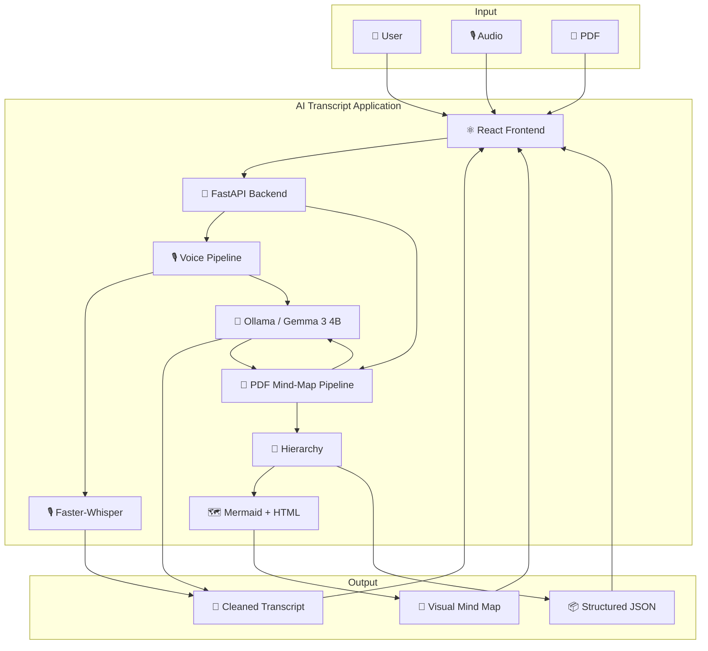
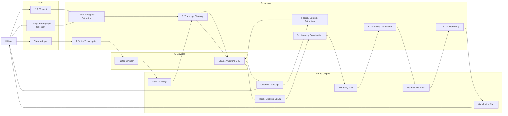

# Diagrams

## 1. Existing Voice Transcription Flow

This diagram shows the original voice-transcription workflow that existed in the project before the PDF mind-map extension.

```mermaid
flowchart LR

    Browser["🌐 React Browser UI"]
    API["🚀 FastAPI /api/transcribe"]
    Temp["📁 Temporary Audio File"]
    Whisper["🎙️ Faster-Whisper base.en"]
    Raw["📝 Raw Transcript"]
    CleanAPI["🧹 FastAPI /api/clean"]
    Service["⚙️ TranscriptionService"]
    LLM["🤖 Ollama / Gemma 3 4B"]
    Cleaned["✨ Cleaned Transcript"]

    Browser -->|Audio upload / recording| API
    API --> Temp
    Temp --> Whisper
    Whisper --> Raw
    Raw --> CleanAPI
    CleanAPI --> Service
    Service --> LLM
    LLM --> Cleaned
    Cleaned --> Browser
```



## 2. PDF-to-Mind-Map Data Flow

This diagram shows how a selected PDF paragraph moves through extraction, cleaning, topic extraction, hierarchy construction, Mermaid generation, and HTML rendering.



## 3. Component Architecture

This diagram shows the main backend modules and their relationships.

```mermaid
flowchart TB

    subgraph API["API Layer"]
        App["🚀 backend/app.py
        FastAPI"]
    end

    subgraph Application["Application Layer"]

        Pipeline["🔄 pdf_mindmap_pipeline.py
        Pipeline Orchestration"]

        Extraction["📄 pdf_extraction.py
        PDF Extraction"]

        Cleaning["🧹 pdf_cleaning.py
        PDF Cleaning"]

        Topics["🧠 topic_extraction.py
        Topic Extraction"]

        Hierarchy["🌳 hierarchy.py
        Hierarchy Construction"]

        MindMap["🗺️ mind_map.py
        Mermaid Generation"]

        Renderer["🖥️ html_renderer.py
        HTML Rendering"]
    end

    subgraph ServiceLayer["Service / AI Layer"]

        Service["⚙️ transcription.py
        TranscriptionService"]

        Whisper["🎙️ Faster-Whisper
        Speech-to-Text"]

        Ollama["🤖 Ollama
        OpenAI-Compatible LLM"]

    end

    subgraph Observability["Observability"]

        Logs["📋 logging_config.py
        ai_transcript.pdf_pipeline"]

    end

    App -->|PDF request| Pipeline

    App -->|Creates / uses service| Service

    Pipeline --> Extraction
    Pipeline --> Cleaning
    Pipeline --> Topics
    Pipeline --> Hierarchy
    Pipeline --> MindMap
    Pipeline --> Renderer

    Cleaning -->|uses clean_with_llm()| Service
    Topics -->|uses LLM boundary| Service

    Service --> Whisper
    Service --> Ollama

    Pipeline -.->|logging| Logs
    Extraction -.->|logging| Logs
    Cleaning -.->|logging| Logs
    Topics -.->|logging| Logs
```

## 4. POST `/api/pdf-mindmap` Sequence

This sequence diagram shows the runtime interaction when the user uploads a PDF and requests a specific page and paragraph.



## 5. High-Level System Data Flow

The following diagram summarizes the complete extended system from user input to output.



## 3. Data Flow Diagram (DFD)

This DFD shows how data moves through the extended application, from user input to transcript and mind-map outputs.


